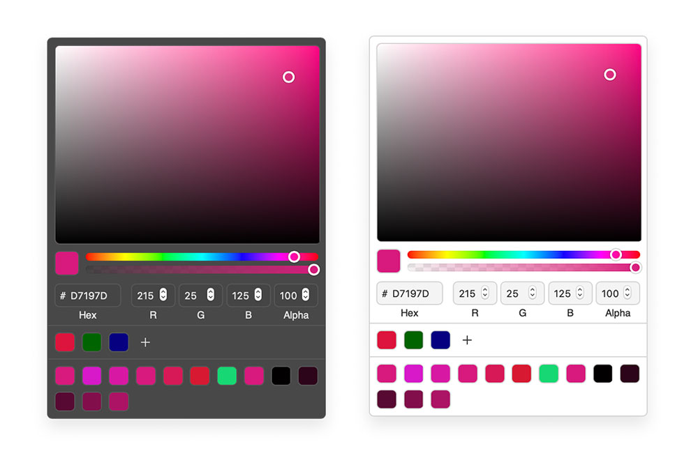

## 🚧 Work in progress 🚧

# React Pick Color

Small color picker component for React.



## Installation

**Add package**

```sh
npm install react-pick-color
# or
yarn add react-pick-color
```

**Add to app**

```js
import React, { useState } from 'react';
import ColorPicker from 'react-pick-color';

const App = () => {
  const [color, setColor] = useState('#fff');

  return (
    <ColorPicker color={color} onChange={(color) => setColor(color.hex)} />
  );
};
```

## Options

#### `color`

`string | { r: number, g: number, b: number, a: number } | { h: number, s: number, l: number, a: number }` | required

The initial color as a hex string or rgba/hsla object.

#### `onChange`

`(color: { hex: string, rgb: object, hsl: object, alpha: number }) => void` | optional

onChange callback with the current color object.

#### `presets`

`array` | optional

#### `combinations`

`"analogous" | "monochromatic" | "splitcomplement" | "triad" | "tetrad" | "complement"` | optional

Provide `combinations` as a string or an array of `combinations`.

#### `hideAlpha`

`boolean` | optional | default: `false`

Hide the alpha range handler.

#### `hideInputs`

`boolean` | optional | default: `false`

Hide color inputs

#### `theme`

`{ background: string, inputBackground: string, color: string, borderColor: string, borderRadius: string, boxShadow: string, width: string }` | optional | default: `themes.light`

You can add a custom theme for styling the colorpicker component or choose one from the predefined themes.

#### Custom Theme

```js
import ColorPicker from 'react-pick-color';

const ThemedColorPicker = () => {
  return (
    <ColorPicker
      color="#3573CB"
      theme={{
        background: 'lightgrey',
        inputBackground: 'grey',
        borderColor: 'darkgrey',
        borderRadius: '8px',
        color: 'black',
        width: '320px',
      }}
    />
  );
};
```

#### Predefined Theme

`react-pick-color` exports a `dark` and a `light` theme.

```js
import ColorPicker, { themes } from 'react-pick-color';

const ThemedColorPicker = () => {
  return <ColorPicker color="#3573CB" theme={themes.dark} />;
};
```

## Hooks

```js
import { useColor } from 'react-pick-color';

// A color as a hex string or rgba/hsla object. Will return a color object.
const { hex, rgb, hsl, hsv, alpha } = useColor('#fff');
```
